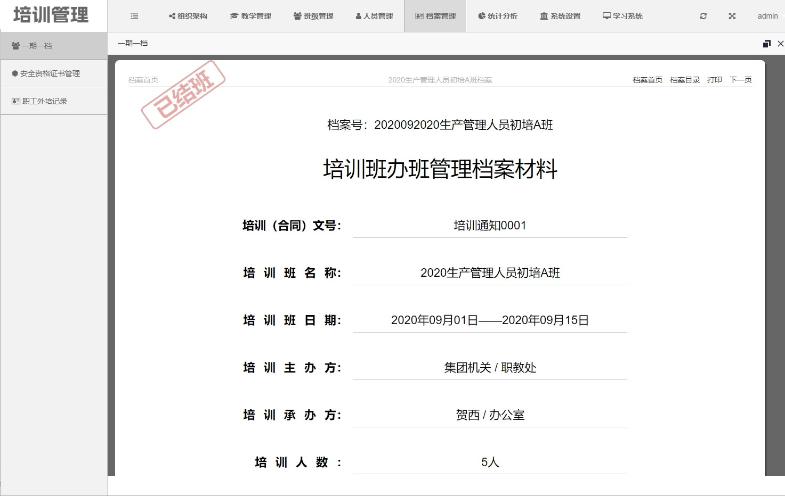
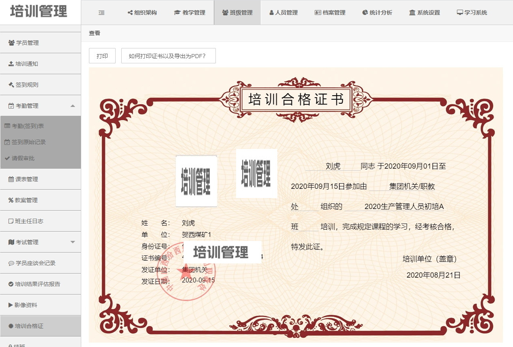
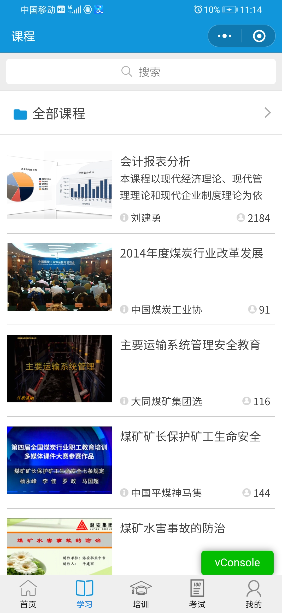

# 培训管理系统
此培训管理系统包括一套WEB端的培训管理系统，一套小程序，适合中大型集团企业、培训学校等进行大规模的线上线下培训，或者证书培训。从培训需求开始，到培训计划的制定，审批，到整个培训过程的全流程管理，到结班后形成一人一档，一期一档，自动生成结业证书或者资格证书。小程序支持教培职能部门，各子单位的教培负责人，以及集团领导、班主任、教师、学生的不同需求，不同用户登录会进入不同的子系统，学生可以在线学习课程，获得积分，在线练习和考试，查看自己的证书，请假，查看自己的学习档案等等。班主任可以实时查看从考勤机上传上来的签到，审批请假，日志，上传影像资料等。

系统支持直接扫描二代身份证自动录入学员信息。

系统支持集成考勤机，可以下发学员的人脸识别信息到考勤机，考勤机支持指纹、人脸和身份证签到和考勤，考勤信息实时上传到系统和班主任小程序，系统根据自定义的签到模板判定学员的迟到、早退、旷课等。

## 管理系统
#### 主要功能
1. 组织架构
单位管理、规章制度、教学管理人员、专兼职教师、设施管理、设备管理、考勤设备管理

2. 教学管理
培训需求、培训计划、办班审批、培训经费、培训评价、年度综合考评、考研活动

3. 班级管理
班级管理、教师安排、学员管理、培训通知、签到规则、考勤管理（签到表、原始记录、请假审批）、课表管理、教案管理、班主任日志、考试管理、学员座谈会记录、培训结果评估报告、影像资料

4. 人员管理
个人资料、人员调动（调动申请、人员接收、调动台帐）、扫描录入

5. 档案管理
一期一档、安全资格证书管理、职工外培记录

6. 统计分析
人员信息统计、计划汇总、取证情况统计、班级信息统计

7. 系统设置
角色管理、后台管理人员、单位字典、个人信息字典、签到模板、系统日志、系统维护

8. 身份证扫描程序
扫描身份证直接录入员工（学员）信息

9.  考勤机
集成考勤机，支持自动签到、自动判断迟到、早退、旷课，支持人脸识别下发，支持身份证、指纹、人脸识别方式考勤。

#### 系统截图
系统总览页

创建班级

考勤机管理

学员考勤（签到）表

结班审批

身份证扫描程序

培训班档案封面

培训班档案目录

批量打印合格证书

办班计划审批表

培训合格证生成

权限管理之角色权限

## 小程序
#### 主要功能
1. 学生子系统
学员须知、课程在线学习、必修课程、关注课程、课程表、请假、签到记录、一人一档、培训合格证、临期证书、资讯中心、在线练习、在线考试、培训评价

2. 班主任子系统
班级信息、教师安排、考试安排、报名管理、报名确认、请假审批、班级日志、课程表、教案首页、教案内容、签到记录、考场报告单、影像资料

3. 教师子系统
班级信息、考试安排、教案首页、教案内容、课程表、授课证明

#### 系统截图

首页 | 课程类别
---|---

课程列表 | 课程章节
---|---

课程播放 |  班主任界面
---|---

教师界面 |  在线考试
---|---

 考试页面 |  个人菜单
---|---

## 联系我
如有疑问请联系：QQ（81224865），电子邮件：tiger.hu.liu@gmail.com
